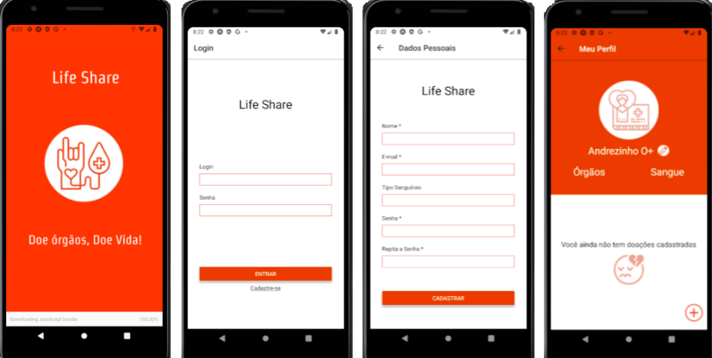

<h1 align="center">Lifeshare-front</h1>

<div align="center">
Lifeshare Mobile App com React Native

  
</div>

<p align="center">
 <a href="#rocket-objetivo">Objetivo</a> •
 <a href="#rocket-features">Features</a> • 
 <a href="#rocket-pré-requisitos">Pré requisitos</a> • 
 <a href="#rocket-rodar">Como rodar</a> • 
 <a href="#rocket-tecnologias">Tecnologias</a> • 
 <a href="#rocket-autor">Autor</a> • 
</p>

<p align="center"> 
	🚧  Lifeshare 🚀 Em construção...    🚧    
</p>
  
<p align="center">  
    
</p>

## :rocket: Objetivo
Desenvolver um app onde as pessoas podem fazer uma gamificação e conseguir prêmios por doações de órgãos ou sangue, fazendo com que seja criado uma cultura onde doar seja comum.

## :rocket: Features

- [x] Login de usuário
- [x] Cadastro de usuário
- [ ] Perfil de usuário
- [ ] Posts de usuários

## :rocket: Pré-requisitos

Antes de começar, você vai precisar ter instalado em sua máquina as seguintes ferramentas:
[Git](https://git-scm.com), [Expo](https://expo.io/), [Yarn](https://yarnpkg.com/), [Nodejs](https://nodejs.org/en/). 
Além disto é bom ter um editor para trabalhar com o código como [VSCode](https://code.visualstudio.com/)

## :rocket: Rodar

```bash
# Clone este repositório
$ git clone https://github.com/5Life/lifeshare-front

# Acesse a pasta do projeto no terminal/cmd
$ cd lifeshare-front

# Instale as dependências
$ yarn install

# Execute a aplicação
$ expo start
```

## :rocket: Tecnologias

As seguintes ferramentas foram usadas na construção do projeto:

- [Expo](https://expo.io/)
- [Node.js](https://nodejs.org/en/)
- [React Native](https://reactnative.dev/)
- [Git](https://git-scm.com)

## :rocket: Autor
- [Patricia Clares](https://github.com/orgs/5Life/people/PatriciaClares)
- [Jenifer Spinoza](https://github.com/orgs/5Life/people/Jenyspa)
- [Gabriel Vacari](https://github.com/orgs/5Life/people/VacariGabriel)
- [Lana Lopes](https://github.com/orgs/5Life/people/bananiitas)
- [Rafael Leão](https://github.com/orgs/5Life/people/rafa-leao)
